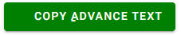

# Fourtitude Asia X Mohamad Rais Interview Test

## Introduction


### Interview Section
[List of interview question from Fourtitude Asia - click to view ](/Asset/net-application.doc)


##### 1. Question 1 advance and basic :heavy_check_mark:

##### 2. Question 2 advance and basic  :heavy_check_mark:

##### 3. Question 3 advance and basic  :heavy_check_mark:

***Basic***
```textmate
GHA14SFSD6K92
```

***Advance Text***
```textmate
e  rbml s nngeshsr etaet.loaldtryadaimt di ghtoeaeuse aC cuciy afskh ss t ovgo tna atstanmeempaa  Itrf oee!oenotou
```

### Guide to use

copy button is available to copy the result or input to clipboard

   

 **Remark** : *This Button did not work on safari*

#### Github code space
1. Wait until environment is restore
2. Open terminal
3. Run  to start the application

```bash 
     dotnet run 
  ```
#### Visual Studio
1. Open the solution file
2. Run the application
  
Requirement  dotnet 6


 this text to test submodule for git

 should be ok
